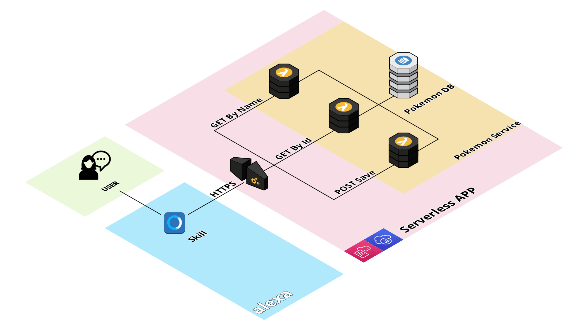

<div id="top"></div>


<!-- PROJECT LOGO -->
<br />
<div align="center">
  </img>
  </img>
  </img>
  <br/>
  <a href="https://github.com/othneildrew/Best-README-Template">
    
  </a>

  <h3 align="center">POKEDEX</h3>

  <p align="center">
    Serverless backend with NoSQL Database and APIs endpoints.
    <br/>
    Alexa Frontend
    <br />
    <br />
    <br />
  </p>
</div>

<!-- TABLE OF CONTENTS -->
<details>
  <summary>Table of Contents</summary>
  <ol>
    <li><a href="#about-the-project">About The Project</a></li>
    <li><a href="#built-with">Built With</a></li>
    <li><a href="#api-usage">API Usage</a></li>
    <li>
      <a href="#getting-started">Getting Started</a>
      <ul>
        <li><a href="#prerequisites">Prerequisites</a></li>
        <li><a href="#installation">Installation</a></li>
      </ul>
    </li>
    <li><a href="#author">Author</a></li>
    <li><a href="#license">License</a></li>
  </ol>
</details>

<br>

<!-- ABOUT THE PROJECT -->
# 1. About The Project 📢


</br>

The project consist of a DynamoDB database with pokemons information and 3 endpoints with lambdas. The frontend cosist of a Alexa Skill that use the API serverless provided. The system follows the IaaC patters.

</br>
<p align="right">(<a href="#top">back to top</a>)</p>


# 2. Built With 🛠️

[Serverless Framework](https://www.serverless.com/): Framework to implement IaaC with cloud providers.
[AWS Services](https://aws.amazon.com/es/):
* [Lambda](https://aws.amazon.com/es/lambda/): Serverless logic functions
* [DynamoDB](https://aws.amazon.com/es/dynamodb/): NoSQL database
* [API Gateway](https://aws.amazon.com/es/api-gateway/): API Rest management
* [CloudWatch event](https://docs.aws.amazon.com/AmazonCloudWatch/latest/events/WhatIsCloudWatchEvents.html): Schedule the system trigger.
* [XRAY](https://aws.amazon.com/es/xray/): Analize and debug distributed apps

_GOOD PRACTICES APPLIED_

* Secondary Index created in the pokmeons table to reduce DynamoDB cost of get to O(1)
 
</br>
<p align="right">(<a href="#top">back to top</a>)</p>


# 3. API 🚀

| HTTP   |      Route      |  Description |
|----------|-------|-------------|
| GET |  /prod/pokemons/id/{name} | Get pokemon info by id |
| GET |   /prod/pokemons/name/{name}   |  Get pokemon by name |
| POST| prod/pokemons/post |   Save a pokemon in the database |

To test the endpoints, you can download the [Postman Collection](./resources/pokemon.postman_collection.json). <br/>Environment needed:
* endpoint: _aws url_
* api-key: _key generated to access the endpoints_

</br>

# 4. Getting Started 🔧  

This is an example of how you may give instructions on setting up your project and deploy to AWS cloud.

## 4.1 Prerequisites

This is an example of how to list things you need to use the software and how to install them.
* npm
  ```sh
  npm install npm@latest -g
  ```
* serverless
  ```sh
  npm install serverless@latest -g
  ```

## 4.2 Installation 🛠️ 

_Below is an example of how you can instruct your audience on installing and setting up your app. This template doesn't rely on any external dependencies or services._

1. Clone the repo
   ```sh
   git clone https://github.com/your_username_/Project-Name.git
   ```
2. Install NPM packages
   ```sh
   npm install
   ```
3. Create a `config.yml`
   ```yml
    pokemonsTableName: <CustomName>
    pokemonsSeeder: [./seeds/<CustomName.json>]
    apiUrls:
      pokemons: <CustomName>
    accountIdNumber: <AWS_ACCOUNT_ID_NUMBER>
   ```

4. Deploy to AWS
   ```sh
   sls deploy --aws-profile <profile>
   ```

5. Insert the seed into the DB
   ```sh
   sls dynamodb:seed --aws-profile <profile>
   ```
</br>

<!-- CONTACT -->
# 5. Author ✒️

José Ramón Martínez Riveiro 

<a href="https://www.linkedin.com/in/joseramonmartinezriveiro/"></a>
<a href="https://joseramonmartinez.github.io/"></a>
</img>
</br>
</br>
<!-- LICENSE -->
# 6. License 📄
`Copyright` © 2017, José Ramón Martínez Riveiro. 


<p align="right">(<a href="#top">back to top</a>)</p>
